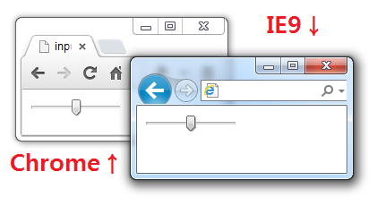

input-range-polyfill
====================

range input polyfill for ie9+




Usage
-----

```html
<!DOCTYPE html>
<html>
  <head>
    <meta http-equiv="Content-Type" content="text/html; charset=utf-8">
    <title>input range polyfill</title>
    <link rel="stylesheet" type="text/css" href="./input-range-polyfill.css">
  </head>
  <body>
    <input type="range" value="50" style="width: 100px;"/>
    <script src="./input-range-polyfill.js"></script>
  </body>
</html>
```